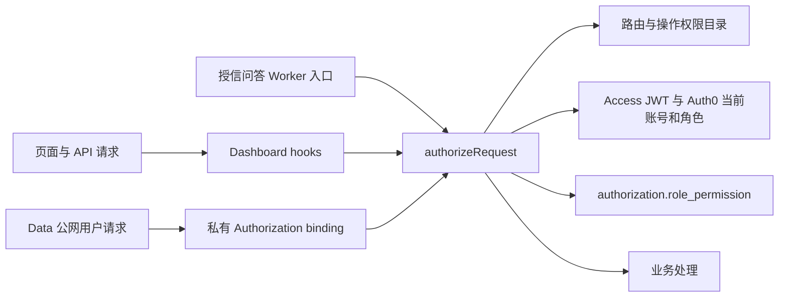

# 统一权限系统

用户、角色、成员关系、账号资料和停用状态由 Auth0 管理。应用仅在现有 Neon 数据库的 `authorization` schema 保存权限目录和角色授权，不维护人员或角色表。

当前数据库的 `auth` schema 属于 Neon 内部 `cloud_admin`，普通数据库 owner 不能创建或删除其中的对象；已根据实际权限限制统一选择 `authorization`。该名称是 SQL 关键字，SQL 中必须写为 `"authorization".permission`、`"authorization".role_permission`。

## 调用结构

- 代码目录：`src/lib/permissions.ts`；路由策略：`src/lib/server/permission-policy.ts`；唯一授权函数：`src/lib/server/authorization.ts`。
- 业务域包括研究、二级池、授信、资金日报、量化模型、融资、账号、权限管理及数据服务。所有业务 GET/HEAD、named actions、写入 API 都要登记，未知入口失败关闭。
- 门户、登录退出、邮箱验证提示及静态资源公开。全局服务端 layout 依赖 pathname，确保客户端导航也经过中央入口。
- 内部 `InternalData` binding 和明确允许的机器身份保持服务边界；Ingest 只有公开健康检查，采集由 Cron/Workflow 执行。Quant 与 office Choice 不增加用户管理系统。

## 内测与正式授权

当前 `AUTHORIZATION_MODE=beta-open`：有效登录账号可使用全部已登记权限，包括未分配角色的账号。后台配置持续保存，页面明确显示内测状态；匿名、停用、邮箱不匹配和未登记操作仍拒绝。

正式启用时先配置并核对各角色的必要页面、读取及操作权限，再将部署变量切为 `enforce`。系统按 Auth0 角色 ID 查询并合并权限；新角色、空配置及未授予操作默认拒绝。权限检查不读取旧融资 API permissions，不缓存用户授权结果。角色重命名不影响授权。

管理入口为 `/management/people`。表单使用版本比对和事务内角色锁，空权限明确保存为 false，避免丢失修改或重新初始化。权限管理 UI 不向 Auth0 创建人员、角色或成员关系。

## 迁移和发布

1. 从最新生产数据建立 Neon 演练分支，使用直连地址；生产切换前另保留不参与迁移的回退分支。
2. 执行只读盘点：`node scripts/apply-unified-permissions.mjs --person-map <确认的映射文件>`，环境提供 `DATABASE_URL_UNPOOLED`。仅通过明确 Auth0 ID 核对人员；替换账号须在映射文件中逐人确认，文件不提交。
3. 增加 `--apply` 后在一个事务内应用 `authorization-migrations/` 和融资 `0032`，分别登记 migration ledger。缺失身份、重复映射、意外约束或依赖均回滚。再次执行不覆盖人工授权。
4. 迁移项目负责人、任务执行人、周报生成人和 SOP 默认角色；删除原人员、权限、审计表及审计触发器。周报生成人列为 `generated_by`。迁移后业务只从 Auth0 解析姓名、角色和提醒收件人。
5. 核对替换账号在 Auth0 中保留原业务角色；运行分支数据库核对、RLS 回滚测试和真实 SvelteKit 构建产物回归。
6. 完成两仓库检查，集成最新 main。先准备 Dashboard 版本，执行已演练的生产 migration，激活 Dashboard，再发布 Data 的 Authorization binding；必要的手动部署无需再次批准。
7. 核对部署版本、未登录拦截、数据库对象和迁移后的引用。Git main 推送触发的自动构建应使用相同已验证代码。

迁移删除旧表后，不能只回滚 Worker 到依赖旧表的版本。需要回退时先在保留的数据分支恢复并核对旧 schema 和业务数据，再成套切回代码与连接；不得覆盖迁移后新产生的业务数据。

## 验证

- `pnpm test` 包含权限格式、全路由登记、匿名/停用/邮箱变更、内测开放、正式多角色授权及撤销、事务回滚、业务 ID 迁移、空角色保存、并发版本冲突与 RLS 测试。
- `pnpm build` 后执行 `node scripts/verify-financing-routes.mjs`、`node scripts/verify-profile-routes.mjs`，使用真实构建产物、签名测试会话、PGlite 与模拟 Auth0/R2，不修改生产账号或发送邮件。
- Data 执行 `pnpm check`、`pnpm deploy:dry`、`git diff --check`，覆盖 binding 拒绝、意外响应、故障关闭和机器身份边界。
- 浏览器和截图验收不属于默认检查，未实际执行时不得声明通过。

## 本次迁移记录

2026-09-08：旧“时阅”人员记录已按用户确认映射到 `auth0|6a9e921870e37d7bbfb76c8f`，其余人员沿用已核实的 Auth0 ID。生产迁移前保留分支 `backup-unified-permissions-20260908`（`br-odd-scene-a6fcavwe`）。账号映射文件位于仓库外，不保存凭证。

权限矩阵的读取、配置和保存只使用 `AUTHORIZATION_DB`，它连接同一 Neon 数据库并明确禁用 Hyperdrive 查询缓存；业务读取继续使用既有 `HYPERDRIVE`。部署配置缺少该权限连接时，正式授权与后台配置失败关闭，不回退到缓存连接。
