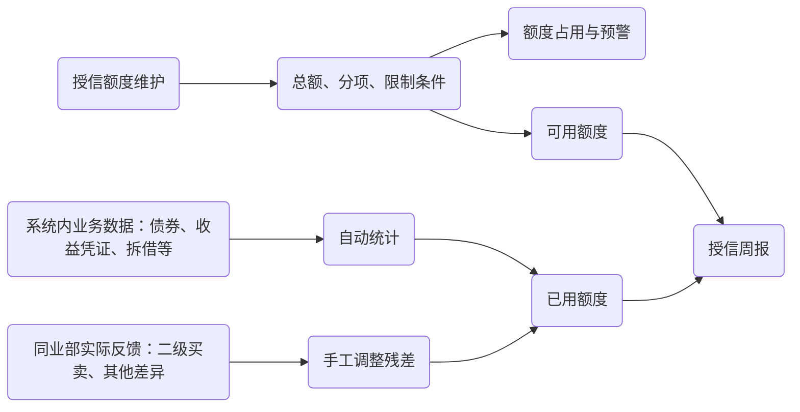

# 授信管理需求文档

## 本期实现边界（2026-08-28）

本期以用户确认的 Excel 日报导入模式为准，覆盖后文原始需求中与当前数据条件冲突的部分：

- 投资人及来源业务数据尚未完整进入数据库，因此暂不实现系统自动占用归集和额度调整审批。当前事实来源是本地解析 Excel 后写入 Neon `credit` schema，数据粒度为报告日期；机构和分项可在详情中自动保存。
- 数据表固定为 `credit.institution` 与 `credit.item`。不建立汇总表、业务导入审计表或导入批次历史；同一报告日期重新导入时事务替换当日记录。
- 授信状态、保密协议状态和授信分项类型使用数据库 enum；Excel 状态为空时按“已撤销”导入。
- “授信一览表”展示 Excel 一览表全部机构；“授信周报”使用周报 Sheet 的机构名单口径。两套汇总独立计算和核对，不用固定差额修正。
- 所有总额、已用和可用汇总只纳入“已获批”。周报五项指标为授信总额、已用额度、可用额度、新增授信家数和到期家数；新增含续签、扩额，到期含状态撤销。
- 授信管理增加日历视图，按全部、到期、新增筛选；一览表去除周报列，增加行序号和逐列排序。
- 周报不包含原需求 FR-007 的“附表：授信额度明细”，授信变动与使用变动继续分开展示。
- 周报可通过浏览器打印功能导出 PDF；近期批复、续作与快讯编辑在具备结构化维护数据后再实现。

## 1. 问题描述

目前授信管理与授信周报维护在共享 Excel 表中，总额、细项、实际余额和周报都需要反复人工核对。

本需求新增“授信管理”模块，包括**授信一览表** 与 **授信周报** 页面。目标是以系统台账替代共享表为日常维护入口，保留人工核准实际占用的能力，并使每周授信信息能够按既有周报版式自动汇总、可编辑、可留档。

## 2. 目标

| 优先级 | 功能         | 主要内容                                                                           |
| ------ | ------------ | ---------------------------------------------------------------------------------- |
| P0     | 授信信息维护 | 授信主体、合并录入关系、状态、期限、总额、分项额度、有效协议、备注和额度限制条件   |
| P1     | 授信使用明细 | 自动统计债券、收益凭证、法透、拆借等业务的已用额度，并通过手工差异项校准实际占用。 |
| P2     | 授信周报     | 自动生成与现有 Excel“授信周报”Sheet 一致的周报，减少每周复制、汇总和核对工作。     |

## 3. 业务流程

核心口径：

### 3.1 授信额度

- **授信主体**：既支持单一机构，也支持银行与理财子按一个合并主体录入。
- **总额**：该授信主体在当前有效授信下的总授信额度。
- **分项**：至少包括债券投资、收益凭证、同业拆借、法透，并支持“其它”分项。
- **额度限制条件**：定义某主体下若干分项额度的组合上限。例如“某银行的债券投资额度与收益凭证额度之和不超过 35 亿元”，作为独立的限制条件管理。

### 3.2 已用额度

由于债券投资存在二级买卖，采用如下口径：
`债券投资已用 = 未到期债券投资之和 + 二级买卖残差`
其中，二级买卖残差依据定期取得的对方实际占用录入。

“其它”作为补充业务类型，用于登记系统未覆盖业务，或记录的使用额度与对方实际使用额度的差异。该项需支持正、负金额，纳入总额实际已用的加总，并支持填写备注。
`总额已用 = 各分项已用之和 + 其它`

## 4. 功能需求

### 4.1 授信信息维护

#### FR-001 授信主体信息

在“授信一览表”中，需支持以下字段的新增、编辑、查询：

- 机构性质、授信主体；
- 合并主体成员机构；
- 是否签署保密协议；
- 授信状态：已获批/申请中/已撤销（根据生效到期日自动生成，未到期=已获批，已到期=申请中，并支持手动改为已撤销）；
- 授信生效日、到期日、授信总额；
- 银行经办机构、我司申请部门、我司经办人；
- 批复说明、备注；
- 变更日期、变更原因；
- 授信续作进展（如有）。

#### FR-002 授信细项

类型按顺序包含：债券投资、收益凭证、法透、同业拆借、其它。其余细项可不需要。
细项额度不需要业务期限与日期，默认与总额相同。

#### FR-003 额度限制条件配置

| 配置项    | 要求                             |
| --------- | -------------------------------- |
| 条件名称  | 例如“债券投资+收益凭证共享上限”  |
| 参与分项  | 可多选分项额度                   |
| 限制金额  | 组合上限，单位与系统额度单位一致 |
| 说明/依据 | 填写批复条款                     |

### 4.2 授信使用明细

#### FR-004 已用额度自动计算

系统需将已有融资负债数据自动归集到已用额度统计中。覆盖债券投资、收益凭证、同业拆借、法透等。

- 细项可展开查看来源业务记录。
- 对合并主体，系统先按成员机构归集业务数据，再在合并主体层面汇总；展开后可查看各成员机构的已用额度。
- 仅汇总仍有效、未到期的记录。
- 无法匹配授信主体的业务记录需触发告警。

#### FR-005 手工调整

系统应支持“债券投资——二级买卖”和“其它”细项，用于残差手工调整。

必填字段：日期、调整金额、调整原因、录入人。

### 4.3 授信周报

#### FR-007 周报自动生成与版式

系统应按现有 Excel“授信周报”Sheet 的顺序、章节和字段生成周报草稿，并支持导出为 PDF。版式包括：

1. 标题“授信周报”、报告日期、授信总额（亿元）、可用余额（亿元）；
2. **一、本周授信快讯**：自动生成编号条目；
3. **二、近期新增授信批复**：银行名称、起始到期日、授信额度、授信明细；
4. **三、近期续签授信情况**：银行名称、到期日、申请额度、授信进展；
5. **附表：授信额度明细**：银行性质、银行名称、总额度、可用额度、使用率。

#### FR-008 本周授信快讯自动更新

系统根据本周新增/续作的授信情况自动生成快讯，并可支持手工修改。

默认文案模板：`{机构} {事件类型}，总额 {总额} 亿元；{主要分项/变化说明}。` 额度变化须展示与变更前版本相比的增减额。

#### FR-009 新增批复与续签信息自动更新

- **近期新增授信批复**：以表格的形式列出近期新增/续签授信，包括机构、起始到期日、总额及授信明细。默认筛选近三个月，按批复日期倒序。
- **近期续签授信情况**：展示目前授信续作进展情况，包括机构、到期日、申请额度和最新授信进展。

#### FR-010 周报发布与留档

- 支持根据历史数据生成周报
- 导出 PDF
